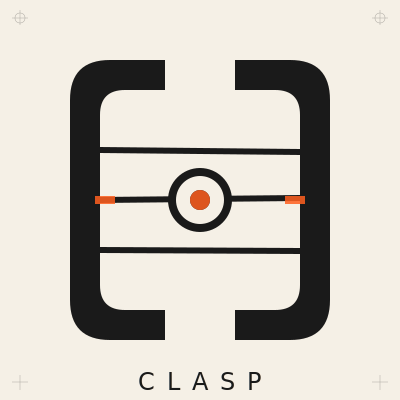

<p align="center">
  
</p>

<h1 align="center">CLASP</h1>

<p align="center">
  <strong>Creative Low-Latency Application Streaming Protocol</strong>
</p>

<p align="center">
  <a href="https://github.com/lumencanvas/clasp/actions/workflows/ci.yml"></a>
  <a href="https://crates.io/crates/clasp-cli"></a>
  <a href="https://www.npmjs.com/package/@clasp-to/core"></a>
  <a href="https://pypi.org/project/clasp-to/"></a>
  <a href="LICENSE"></a>
  <a href="https://clasp.to"></a>
</p>

---

CLASP is a real-time infrastructure layer for connected devices. One binary protocol handles state synchronization, pub/sub messaging, E2E encryption, device identity, programmable transforms, reactive automation, and multi-site federation. Bridges for MQTT, BLE, Serial, HTTP, OSC, MIDI, DMX, and Art-Net make existing hardware work together immediately.

## Why CLASP?

Building connected applications means solving the same problems every time: state sync, auth, encryption, discovery, automation, multi-site coordination. Every project reinvents this from scratch. CLASP provides all of it in one system.

Five things set it apart from generic pub/sub:

**Semantic signal types.** The router distinguishes Params (stateful, conflict-resolved, persisted, delivered to late-joiners), Events (confirmed, ephemeral), Streams (best-effort, droppable under congestion), Gestures (phased lifecycle with begin/update/end), and Timelines (keyframed automation with easing). The infrastructure layer makes routing decisions that other systems push to application code.

**Protocol bridging as architecture.** MQTT, OSC, MIDI, DMX, Art-Net, sACN, HTTP, WebSocket, Socket.IO, BLE, Serial. Each protocol gets one bridge. Any device on any protocol can read and write state from any other device on any other protocol, through one router. N bridges, not N-squared adapters.

**Late-joiner state sync.** New clients receive a snapshot of all current Param state the instant they subscribe. Five conflict strategies (LWW, Max, Min, Lock, Merge) with optimistic concurrency via revision numbers. This eliminates an entire class of "initial state" bugs that plague every real-time system.

**Server-side rules engine.** Reactive automation evaluated on every state change: thresholds, pattern-matched triggers, conditions, transforms, cooldowns. Zero application code. The router becomes a programmable edge compute node.

**Federation with namespace ownership.** Hub-leaf topology where each site owns its namespace prefix. No distributed consensus needed. DefraDB integration adds Merkle CRDT-based persistent state that survives restarts and syncs across sites automatically.

```
┌─────────────┐     ┌─────────────┐     ┌─────────────┐
│  TouchOSC   │     │   Ableton   │     │  LED Strip  │
│  (OSC)      │     │   (MIDI)    │     │  (Art-Net)  │
└──────┬──────┘     └──────┬──────┘     └──────┬──────┘
       │                   │                   │
       └───────────────────┼───────────────────┘
                           │
                    ┌──────▼──────┐
                    │    CLASP    │
                    │   Router    │
                    └──────┬──────┘
                           │
       ┌───────────────────┼───────────────────┐
       │                   │                   │
┌──────▼──────┐     ┌──────▼──────┐     ┌──────▼──────┐
│  Web UI     │     │  IoT Hub    │     │  Resolume   │
│ (WebSocket) │     │  (MQTT)     │     │  (OSC)      │
└─────────────┘     └─────────────┘     └─────────────┘
```

## Install

### CLI

```bash
cargo install clasp-cli
```

### Packages

**Client Libraries**

| Platform | Package | Install |
|----------|---------|---------|
| **JavaScript** | [@clasp-to/sdk](https://www.npmjs.com/package/@clasp-to/sdk) | `npm install @clasp-to/sdk` |
| **JavaScript** | [@clasp-to/core](https://www.npmjs.com/package/@clasp-to/core) | `npm install @clasp-to/core` |
| **JavaScript** | [@clasp-to/crypto](https://www.npmjs.com/package/@clasp-to/crypto) | `npm install @clasp-to/crypto` |
| **Python** | [clasp-to](https://pypi.org/project/clasp-to/) | `pip install clasp-to` |
| **Arduino** | [Clasp](https://github.com/lumencanvas/clasp/tree/main/bindings/arduino/Clasp) | Arduino Library Manager |

**Rust Crates: Core**

| Crate | Description | Install |
|-------|-------------|---------|
| [clasp-core](https://crates.io/crates/clasp-core) | Types, codec, state management | `cargo add clasp-core` |
| [clasp-client](https://crates.io/crates/clasp-client) | High-level async client | `cargo add clasp-client` |
| [clasp-router](https://crates.io/crates/clasp-router) | Message routing and pattern matching | `cargo add clasp-router` |
| [clasp-transport](https://crates.io/crates/clasp-transport) | WebSocket, QUIC, TCP, BLE, Serial | `cargo add clasp-transport` |
| [clasp-bridge](https://crates.io/crates/clasp-bridge) | Protocol bridges (OSC, MIDI, MQTT, etc.) | `cargo add clasp-bridge` |
| [clasp-crypto](https://crates.io/crates/clasp-crypto) | E2E encryption (AES-256-GCM, ECDH) | `cargo add clasp-crypto` |
| [clasp-identity](https://crates.io/crates/clasp-identity) | Unified Ed25519 identity (EntityId + DID + PeerID) | `cargo add clasp-identity` |

**Rust Crates: Infrastructure**

| Crate | Description | Install |
|-------|-------------|---------|
| [clasp-caps](https://crates.io/crates/clasp-caps) | Delegatable Ed25519 capability tokens | `cargo add clasp-caps` |
| [clasp-registry](https://crates.io/crates/clasp-registry) | Persistent entity identity registry | `cargo add clasp-registry` |
| [clasp-journal](https://crates.io/crates/clasp-journal) | Append-only event journal | `cargo add clasp-journal` |
| [clasp-rules](https://crates.io/crates/clasp-rules) | Server-side reactive rules engine | `cargo add clasp-rules` |
| [clasp-federation](https://crates.io/crates/clasp-federation) | Router-to-router federation | `cargo add clasp-federation` |
| [clasp-discovery](https://crates.io/crates/clasp-discovery) | mDNS/DNS-SD device discovery | `cargo add clasp-discovery` |
| [clasp-lens](https://crates.io/crates/clasp-lens) | LensVM WASM transform host | `cargo add clasp-lens` |

**Rust Crates: DefraDB Integration** ([docs](docs/defra/) | [DEFRA.md](DEFRA.md))

| Crate | Description | Install |
|-------|-------------|---------|
| [clasp-journal-defra](https://crates.io/crates/clasp-journal-defra) | DefraDB journal backend with P2P sync | `cargo add clasp-journal-defra` |
| [clasp-state-defra](https://crates.io/crates/clasp-state-defra) | Write-through cache with DefraDB persistence | `cargo add clasp-state-defra` |
| [clasp-defra-bridge](https://crates.io/crates/clasp-defra-bridge) | Bidirectional DefraDB/CLASP signal bridge | `cargo add clasp-defra-bridge` |
| [clasp-config-defra](https://crates.io/crates/clasp-config-defra) | P2P config sync with version history | `cargo add clasp-config-defra` |
| [clasp-registry-defra](https://crates.io/crates/clasp-registry-defra) | DefraDB entity store with P2P identity sync | `cargo add clasp-registry-defra` |
| [clasp-defra-transport](https://crates.io/crates/clasp-defra-transport) | DefraDB sync over CLASP transports | `cargo add clasp-defra-transport` |

### Deploy to DigitalOcean

Create an Ubuntu 22.04 droplet (1 GB+ RAM), SSH in, and run:

```bash
curl -fsSL https://raw.githubusercontent.com/lumencanvas/clasp/main/deploy/marketplace/digitalocean/bootstrap.sh | bash
```

This installs Docker, pulls the relay image, and sets up the `clasp-setup` interactive configurator. Then run `clasp-setup` to choose your deployment profile, configure TLS, auth, persistence, protocol bridges, and start the relay.

To remove CLASP from a droplet:

```bash
docker compose -f /opt/clasp/docker-compose.yml down -v
rm -rf /opt/clasp /var/lib/clasp /usr/local/bin/clasp-setup
```

See [deployment docs](docs/deployment/digitalocean-marketplace.md) for full details.

### Desktop App

Download the latest release for your platform:

- **macOS**: [CLASP Bridge.dmg](https://github.com/lumencanvas/clasp/releases/latest)
- **Windows**: [CLASP Bridge Setup.exe](https://github.com/lumencanvas/clasp/releases/latest)
- **Linux**: [clasp-bridge.AppImage](https://github.com/lumencanvas/clasp/releases/latest)

## CLASP SDK

The easiest way to use CLASP from JavaScript/TypeScript. `@clasp-to/sdk` wraps the core protocol with a human-friendly API:

```typescript
import clasp from '@clasp-to/sdk'

const c = await clasp('ws://localhost:7330', { name: 'My App' })

await c.set('/lights/brightness', 0.8)       // persistent state
c.on('/lights/**', (val, addr) => { ... })    // wildcard subscribe
await c.emit('/cues/go')                      // fire-and-forget event
c.stream('/sensors/accel', { x: 0.1, y: 9.8 }) // high-rate data

// Devices, encrypted rooms, rules, bridges. All built in
const device = await c.register({ name: 'Sensor', scopes: ['write:/sensors/**'] })
const room = await c.room('/chat/private')    // E2E encrypted
c.rule('alert', { when: '/temp', above: 30, then: { emit: ['/alert', 'hot!'] } })
```

For lower-level control, use `@clasp-to/core` directly ([docs](docs/sdk/javascript.md)).

## DefraDB Integration

CLASP state is ephemeral by default. [DefraDB](https://source.network/defradb) is a peer-to-peer document database built on Merkle CRDTs. Six crates connect them so CLASP gets persistent, distributed state without giving up the sub-100us hot path.

Signals route through the in-memory cache as before. Writes flush to DefraDB in the background. DefraDB handles P2P replication between nodes. On restart, state loads back from DefraDB automatically.

This is primarily a win for CLASP: durable state, multi-router sync, and crash recovery. It may also be useful as a data ingestion path for DefraDB, since CLASP bridges MQTT, BLE, Serial, and HTTP protocols that DefraDB does not speak natively.

```bash
clasp-router --journal --journal-backend defra --journal-defra-url http://localhost:9181
```

```
CLASP Router A ──> DefraDB Node 1 ◄──P2P──► DefraDB Node 2 <── CLASP Router B
```

See [DEFRA.md](DEFRA.md) for the full guide. Detailed docs at [docs/defra/](docs/defra/).

## Quick Start

### CLI Usage

**Important:** CLASP uses a router-based architecture. Start a router first, then add protocol connections.

```bash
# 1. Start CLASP router (required - central message hub)
clasp server --port 7330

# 2. Start protocol connections (these connect TO the router)
# OSC: listens for OSC messages, translates and routes to CLASP
clasp osc --port 9000

# MQTT: connects to MQTT broker, translates and routes to CLASP
clasp mqtt --host broker.local --port 1883

# HTTP: provides REST API that translates to CLASP
clasp http --bind 0.0.0.0:3000

# Show all options
clasp --help
```

**How it works:** Protocol commands (`clasp osc`, `clasp mqtt`, etc.) create bidirectional protocol connections that connect to the CLASP router. They translate between external protocols and CLASP, routing all messages through the central router. This enables any protocol to communicate with any other protocol through CLASP.

See [Bridge Setup Guide](docs/guides/bridge-setup.md) for detailed setup instructions.

## CLASP-to-CLASP Examples

CLASP clients can communicate directly with each other through a CLASP router. Here are examples in each supported language:

### JavaScript/TypeScript

**Server (Node.js):**
```typescript
import { ClaspBuilder } from '@clasp-to/core';

// Connect to router
const server = await new ClaspBuilder('ws://localhost:7330')
  .withName('LED Controller')
  .connect();

// Listen for brightness changes
server.on('/lights/*/brightness', (value, address) => {
  console.log(`Setting ${address} to ${value}`);
  // Control actual LED hardware here
});

// Publish current state
await server.set('/lights/strip1/brightness', 0.8);
```

**Client (Browser or Node.js):**
```typescript
import { ClaspBuilder } from '@clasp-to/core';

const client = await new ClaspBuilder('ws://localhost:7330')
  .withName('Control Panel')
  .connect();

// Control the lights
await client.set('/lights/strip1/brightness', 0.5);

// Read current value
const brightness = await client.get('/lights/strip1/brightness');
console.log(`Current brightness: ${brightness}`);

// Subscribe to changes from other clients
client.on('/lights/**', (value, address) => {
  console.log(`${address} changed to ${value}`);
});
```

### Python

**Publisher:**
```python
import asyncio
from clasp import ClaspBuilder

async def main():
    client = await (
        ClaspBuilder('ws://localhost:7330')
        .with_name('Sensor Node')
        .connect()
    )

    # Publish sensor data
    while True:
        temperature = read_sensor()  # Your sensor code
        await client.set('/sensors/room1/temperature', temperature)
        await asyncio.sleep(1)

asyncio.run(main())
```

**Subscriber:**
```python
import asyncio
from clasp import ClaspBuilder

async def main():
    client = await (
        ClaspBuilder('ws://localhost:7330')
        .with_name('Dashboard')
        .connect()
    )

    # React to sensor updates
    @client.on('/sensors/*/temperature')
    def on_temperature(value, address):
        print(f'{address}: {value}°C')

    # Keep running
    await client.run()

asyncio.run(main())
```

### Rust

**Publisher:**
```rust
use clasp_client::{Clasp, ClaspBuilder};
use clasp_core::Value;

#[tokio::main]
async fn main() -> anyhow::Result<()> {
    let client = ClaspBuilder::new("ws://localhost:7330")
        .name("Rust Publisher")
        .connect()
        .await?;

    // Set values that other clients can subscribe to
    client.set("/app/status", Value::String("running".into())).await?;
    client.set("/app/counter", Value::Int(42)).await?;

    // Stream high-frequency data
    for i in 0..100 {
        client.set("/app/position", Value::Float(i as f64 * 0.1)).await?;
        tokio::time::sleep(std::time::Duration::from_millis(16)).await;
    }

    client.close().await?;
    Ok(())
}
```

**Subscriber:**
```rust
use clasp_client::{Clasp, ClaspBuilder};

#[tokio::main]
async fn main() -> anyhow::Result<()> {
    let client = ClaspBuilder::new("ws://localhost:7330")
        .name("Rust Subscriber")
        .connect()
        .await?;

    // Subscribe to all app signals
    let _unsub = client.subscribe("/app/**", |value, address| {
        println!("{} = {:?}", address, value);
    }).await?;

    // Keep running
    tokio::signal::ctrl_c().await?;
    client.close().await?;
    Ok(())
}
```

### Cross-Language Example

CLASP clients in different languages can seamlessly communicate:

```
┌────────────────────┐     ┌─────────────────┐     ┌────────────────────┐
│   Python Sensor    │     │  CLASP Router   │     │  JS Web Dashboard  │
│                    │────▶│  (port 7330)    │◀────│                    │
│ set('/temp', 23.5) │     │                 │     │ on('/temp', ...)   │
└────────────────────┘     └─────────────────┘     └────────────────────┘
                                   ▲
                                   │
                           ┌───────┴───────┐
                           │ Rust Actuator │
                           │               │
                           │ on('/temp',   │
                           │   adjust_hvac)│
                           └───────────────┘
```

## Features

- **Protocol Connections**: OSC, MIDI, Art-Net, DMX, MQTT, WebSocket, Socket.IO, HTTP/REST
- **Signal Routing**: Wildcard patterns (`*`, `**`), 18 built-in transforms, custom WASM transforms via LensVM
- **Low Latency**: WebSocket transport with sub-millisecond overhead
- **State Sync**: Automatic state synchronization between clients
- **E2E Encryption**: Client-side AES-256-GCM encryption with ECDH key exchange, TOFU, auto-rotation
- **Delegatable Auth**: Ed25519 capability tokens with UCAN-style delegation chains
- **Entity Registry**: Persistent identity for devices, users, services, and routers
- **Journal Persistence**: Append-only event log for crash recovery and state replay
- **Rules Engine**: Server-side reactive automation (triggers, conditions, transforms)
- **Federation**: Router-to-router state sharing for multi-site deployments
- **Desktop App**: Visual protocol configuration and signal monitoring
- **DefraDB Integration**: P2P persistent storage via Merkle CRDTs, zero-config multi-node sync, Zanzibar-style access control
- **CLI Tool**: Start routers and protocol connections from the command line
- **Embeddable**: Rust crates, WASM module, Python, JavaScript

## Performance

We believe in transparent benchmarking with honest methodology.

### Codec Benchmarks (In-Memory, Single Core)

These measure raw encode/decode speed, the **theoretical ceiling**, not system throughput:

| Protocol | Encode | Decode | Size | Notes |
|----------|--------|--------|------|-------|
| MQTT | 11.4M/s | 11.4M/s | 19 B | Minimal protocol |
| **CLASP** | **8M/s** | **11M/s** | **31 B** | Rich semantics |
| OSC | 4.5M/s | 5.7M/s | 24 B | UDP only |
| JSON-WS | ~2M/s | ~2M/s | ~80 B | Typical JSON overhead |

⚠️ **Important**: These are codec-only numbers (no network, no routing, no state). Real system throughput is 10-100x lower depending on features enabled.

### System Throughput (End-to-End)

Actual measured performance on localhost (macOS, M-series):

| Metric | P50 | P95 | P99 | Notes |
|--------|-----|-----|-----|-------|
| **SET (fire-and-forget)** | <1µs | 1µs | 39µs | Client → Router |
| **Single-hop** | 34µs | 52µs | 82µs | Pub → Router → Sub |
| **Fanout (10 subs)** | 1.3ms | 1.4ms | 1.4ms | Time until ALL receive |
| **Fanout (100 subs)** | 2.0ms | 2.2ms | 2.6ms | Time until ALL receive |
| **Throughput** | 74k msg/s | - | - | Single client, sustained |

Run benchmarks yourself:
```bash
cargo run --release -p clasp-e2e --bin latency-benchmarks
cargo run --release -p clasp-e2e --bin chaos-tests
```

### Why Binary Encoding?

CLASP uses efficient binary encoding that is **55% smaller** than JSON:

```
JSON: {"type":"SET","address":"/test","value":0.5,...} → ~80 bytes
CLASP: [SET][flags][len][addr][value][rev]             → 31 bytes
```

### Feature Comparison

| Feature | CLASP | OSC | MQTT |
|---------|-------|-----|------|
| State synchronization | ✅ | ❌ | ❌ |
| Late-joiner support | ✅ | ❌ | ✅ |
| Typed signals (Param/Event/Stream) | ✅ | ❌ | ❌ |
| Wildcard subscriptions | ✅ | ❌ | ✅ |
| Clock sync | ✅ | ✅ | ❌ |
| E2E encryption | ✅ | ❌ | ❌ |
| Multi-protocol bridging | ✅ | ❌ | ❌ |
| Delegatable auth (Ed25519) | ✅ | ❌ | ❌ |
| Router-to-router federation | ✅ | ❌ | ❌ |
| Server-side rules engine | ✅ | ❌ | ❌ |
| Programmable transforms (WASM) | ✅ | ❌ | ❌ |
| P2P state persistence (CRDTs) | ✅ | ❌ | ❌ |

### Timing Guarantees

- **LAN (wired)**: Target ±1ms clock sync accuracy
- **WiFi**: Target ±5-10ms clock sync accuracy
- **Not suitable for**: Hard realtime, safety-critical, industrial control systems

CLASP is designed for **soft realtime** applications: live performance, IoT control, interactive installations, sensor networks, collaborative tools.

## Supported Protocols

| Protocol | Direction | Features |
|----------|-----------|----------|
| **CLASP** | Bidirectional | Native protocol, WebSocket transport, sub-ms latency |
| **OSC** | Bidirectional | UDP, bundles, all argument types |
| **MIDI** | Bidirectional | Notes, CC, program change, sysex |
| **Art-Net** | Bidirectional | DMX over Ethernet, multiple universes |
| **DMX** | Output | USB interfaces (FTDI, ENTTEC) |
| **MQTT** | Bidirectional | v3.1.1/v5, TLS, wildcards |
| **WebSocket** | Bidirectional | Client/server, JSON/binary |
| **Socket.IO** | Bidirectional | v4, rooms, namespaces |
| **HTTP** | Bidirectional | REST API, CORS, client/server |

## Transports

CLASP supports multiple network transports for different use cases:

| Transport | Use Case | Features |
|-----------|----------|----------|
| **WebSocket** | Web apps, cross-platform | Default transport, works everywhere, JSON or binary |
| **QUIC** | Native apps, mobile | TLS 1.3, 0-RTT, connection migration, multiplexed streams |
| **UDP** | Low-latency, local network | Minimal overhead, best for high-frequency data |
| **TCP** | Reliable delivery | For environments where UDP is blocked |
| **Serial** | Hardware integration | UART/RS-232 for embedded devices |
| **BLE** | Wireless sensors | Bluetooth Low Energy for IoT devices |
| **WebRTC** | P2P, browser-to-browser | NAT traversal, direct peer connections |

Enable transports with feature flags:
```bash
# Default (WebSocket + UDP + QUIC)
cargo add clasp-transport

# All transports
cargo add clasp-transport --features full

# Specific transports
cargo add clasp-transport --features "websocket,quic,serial"
```

## CLASP Chat

[CLASP Chat](apps/chat/) is a production chat application built on a generic CLASP relay. Rooms, DMs, friend lists, video calling, E2E encryption, and namespace-based organization, all expressed as pub/sub addresses on a router that knows nothing about chat. The relay never needs to be updated for new features. See **[CHAT.md](CHAT.md)** for the full architecture breakdown.

## Distributed Infrastructure

CLASP includes opt-in distributed infrastructure crates for production deployments that need authentication, persistence, automation, and multi-site operation. All features are behind Cargo feature flags and add zero overhead when disabled.

### Capability Tokens

Delegatable Ed25519 capability tokens (UCAN-style) for fine-grained access control:

```bash
# Generate a root keypair
clasp key generate --out root.key

# Create a root token with full admin access
clasp token cap create --key root.key --scopes "admin:/**" --expires 30d

# Delegate with narrower scopes
clasp token cap delegate <parent-token> --key child.key --scopes "write:/lights/**"
```

### Entity Registry

Persistent identity for devices, users, services, and routers with Ed25519 signatures:

```bash
# Generate an entity keypair
clasp token entity keygen --out sensor.key --name "Sensor A" --type device

# Mint a token
clasp token entity mint --key sensor.key
```

### Journal Persistence

Append-only event log for crash recovery. The router records all SET/PUBLISH operations and can replay state on restart:

```rust
let journal = Arc::new(SqliteJournal::new("state.db")?);
let router = Router::new(config).with_journal(journal);
```

### Rules Engine

Server-side reactive automation with triggers, conditions, and transforms:

```json
{
  "id": "motion-lights",
  "trigger": { "OnChange": { "pattern": "/sensors/*/motion" } },
  "actions": [{ "Set": { "address": "/lights/hallway", "value": 1.0 } }],
  "cooldown": { "secs": 5, "nanos": 0 }
}
```

### LensVM Transforms

Programmable WASM signal transforms that run on the router. Write a filter in Rust, compile to `wasm32-unknown-unknown`, load it at runtime. Lenses are bidirectional (forward + inverse) and configurable via parameters.

Three bundled lenses ship with CLASP: `lowpass` (IIR filter), `hysteresis` (Schmitt trigger for debouncing), and `moving-average`. Custom lenses are typically 30-100KB compiled.

```bash
# Build a lens
cd lenses/lowpass
cargo build --target wasm32-unknown-unknown --release

# Validate and test it
clasp lens validate ./target/wasm32-unknown-unknown/release/lowpass.wasm
clasp lens test ./target/wasm32-unknown-unknown/release/lowpass.wasm \
    --input '0.5' --params '{"alpha": 0.3}'
```

See [docs/transforms/authoring-lenses.md](docs/transforms/authoring-lenses.md) for the authoring guide.

### Federation

Router-to-router state sharing for multi-site deployments using a hub/leaf topology:

```bash
# Hub (accepts inbound peers)
clasp server --port 7330 --features federation

# Leaf (connects to hub, owns /site-a/**)
clasp server --port 7331 \
    --federation-mode leaf \
    --federation-hub ws://hub:7330 \
    --federation-namespaces "/site-a/**"
```

## Documentation

Visit **[clasp.to](https://clasp.to)** for full documentation.

- [Getting Started](https://clasp.to/docs/getting-started)
- [Protocol Specification](https://clasp.to/docs/protocol)
- [API Reference](https://clasp.to/docs/api)
- [DefraDB Integration](docs/defra/) | [DEFRA.md](DEFRA.md)
- [E2E Encryption](docs/auth/e2e-encryption.md)
- [Examples](https://clasp.to/docs/examples)

## Building from Source

### Prerequisites

- Rust 1.75+
- Node.js 20+ (for desktop app)
- Platform-specific dependencies:
  - **Linux**: `libasound2-dev`, `libudev-dev`
  - **macOS**: Xcode Command Line Tools

### Build

```bash
# Clone the repository
git clone https://github.com/lumencanvas/clasp.git
cd clasp

# Build all Rust crates
cargo build --release

# Build with all distributed infrastructure features
cargo build --release --features full

# Build desktop app
cd apps/bridge
npm install
npm run build
```

### Run Tests

```bash
cargo test --workspace
```

## Contributing

We welcome contributions! Please see [CONTRIBUTING.md](CONTRIBUTING.md) for guidelines.

## License

Licensed under either of:

- Apache License, Version 2.0 ([LICENSE-APACHE](LICENSE-APACHE) or http://www.apache.org/licenses/LICENSE-2.0)
- MIT license ([LICENSE-MIT](LICENSE-MIT) or http://opensource.org/licenses/MIT)

at your option.

## Acknowledgments

CLASP builds on the shoulders of giants:
- [Quinn](https://github.com/quinn-rs/quinn) - QUIC implementation
- [rosc](https://github.com/klingtnet/rosc) - OSC codec
- [midir](https://github.com/Boddlnagg/midir) - MIDI I/O
- [rumqttc](https://github.com/bytebeamio/rumqtt) - MQTT client
- [DefraDB](https://github.com/sourcenetwork/defradb) - P2P document database (Merkle CRDTs)

---

<p align="center">
  Maintained by <a href="https://lumencanvas.studio">LumenCanvas</a> | 2026
</p>
