# State & Lifecycle Diagrams

All diagrams use [Mermaid](https://mermaid.js.org/) syntax.

## Authentication Flow

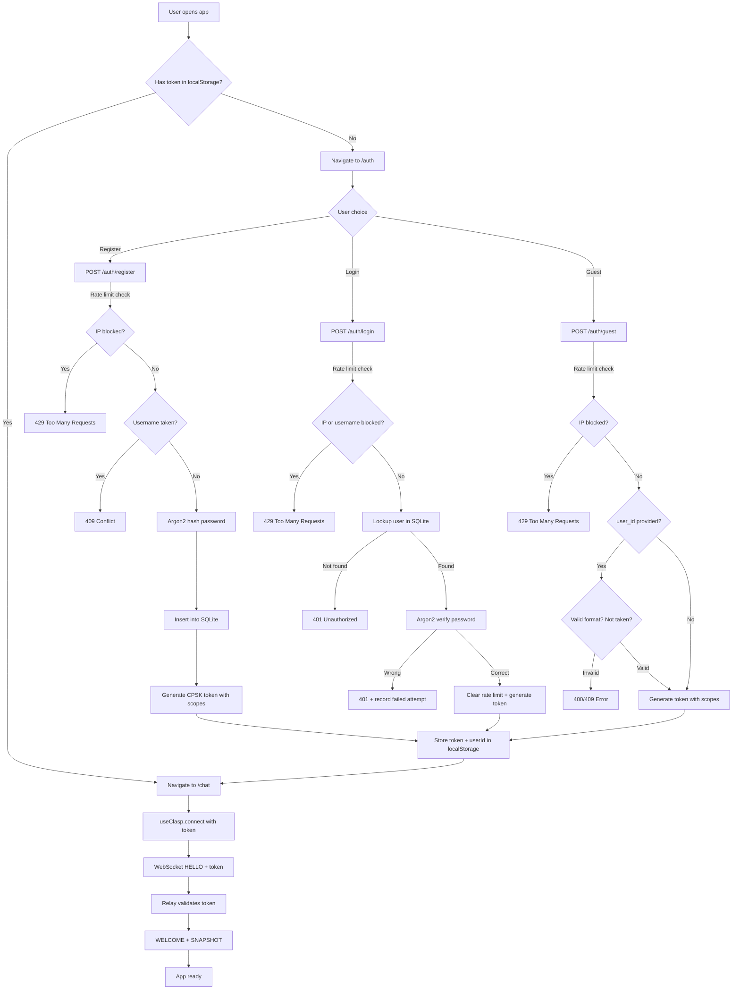

## Room Lifecycle

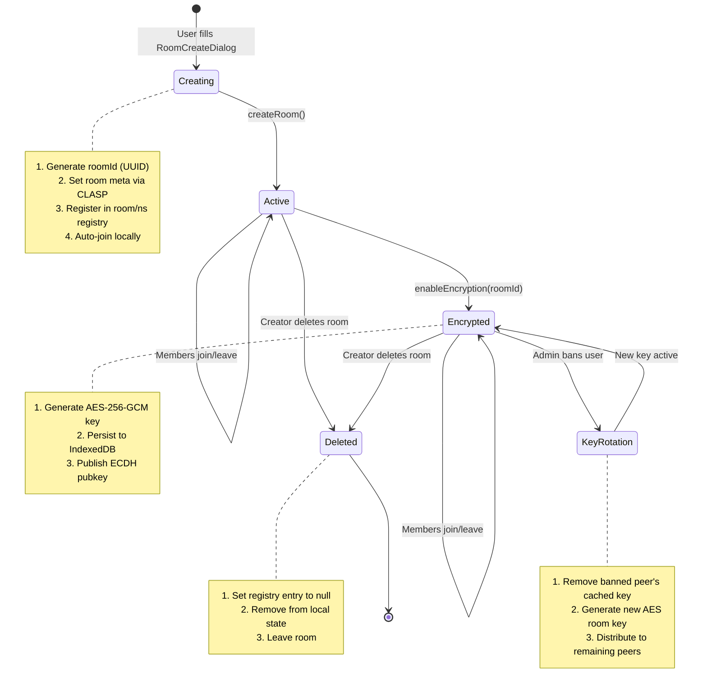

## E2E Key Exchange Sequence

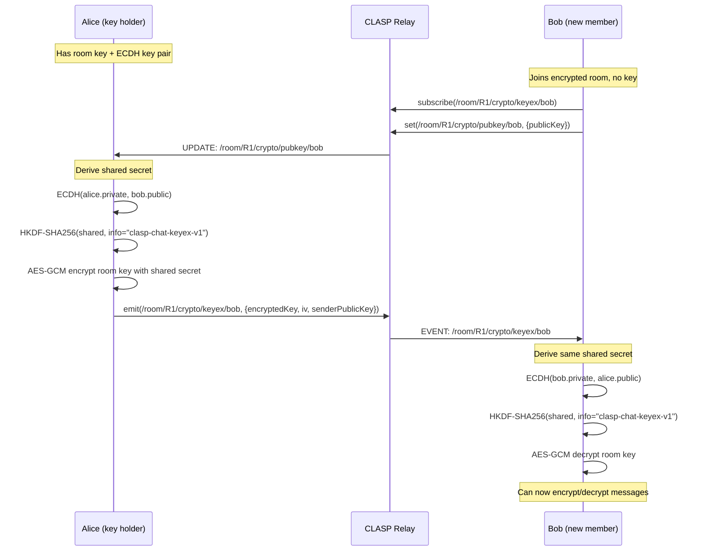

## Password-Gated Key Exchange

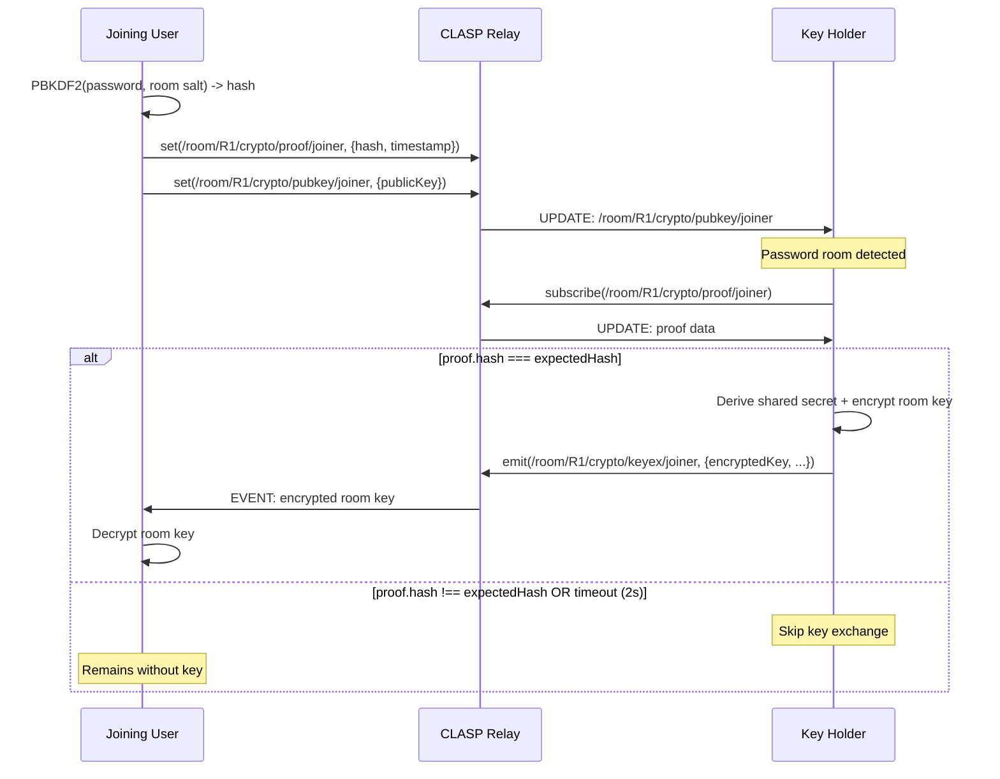

## Presence & Typing State Machine

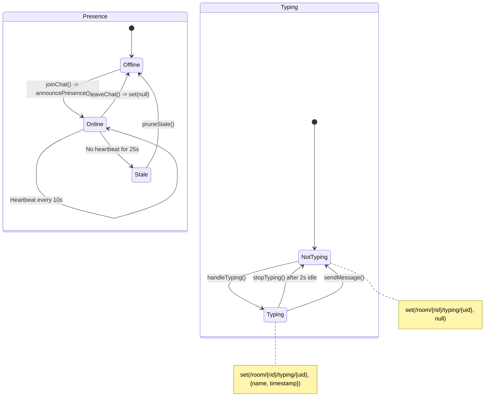

### Presence Timing Constants

| Constant | Value | Purpose |
|----------|-------|---------|
| `PRESENCE_HEARTBEAT` | 10,000 ms | Interval between presence announcements |
| `PRESENCE_STALE` | 25,000 ms | Time before a participant is considered stale |
| `TYPING_TIMEOUT` | 2,000 ms | Idle time before typing indicator clears |
| `TYPING_EXPIRE` | 3,000 ms | Remote typing indicator auto-expiry |
| `DISCONNECT_GRACE` | 5,000 ms | Grace period before marking disconnected |

## Message Flow (Encrypted Room)

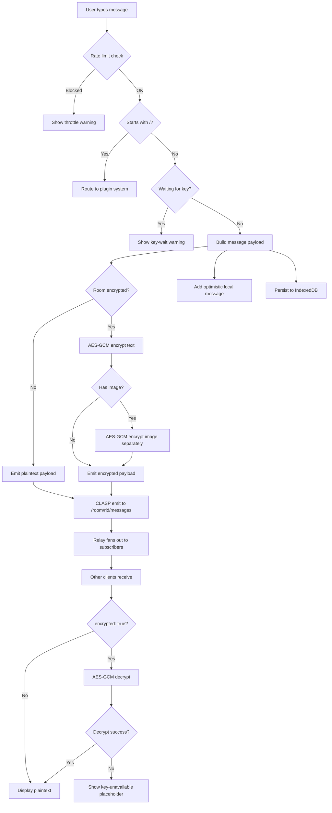

## WebSocket Connection State

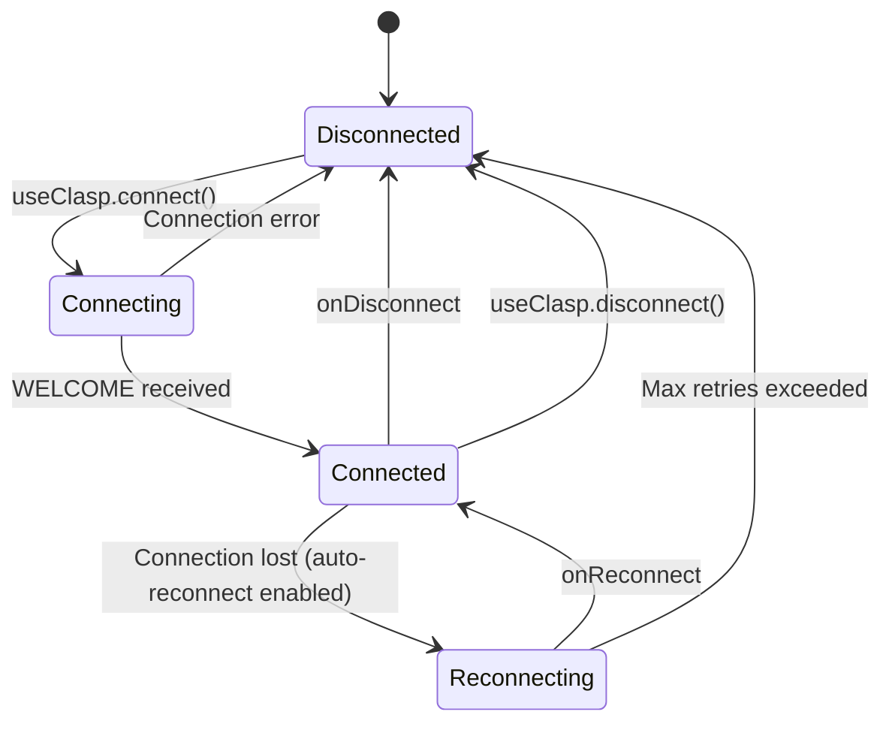

## Room Join Flow (with Crypto)

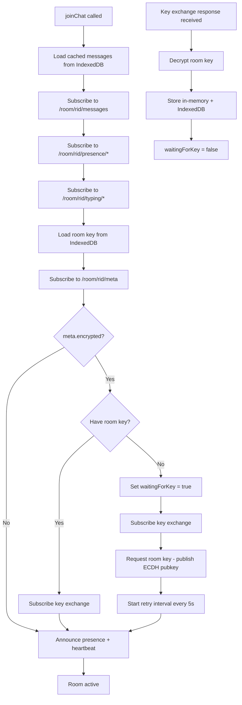

## DM Lifecycle

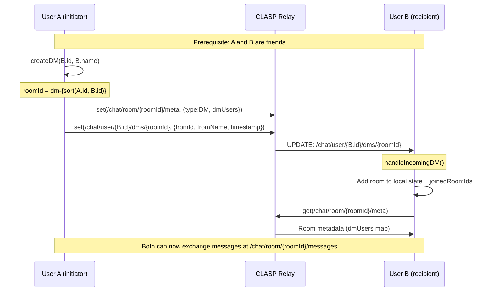

### DM Reconnect (Page Refresh)

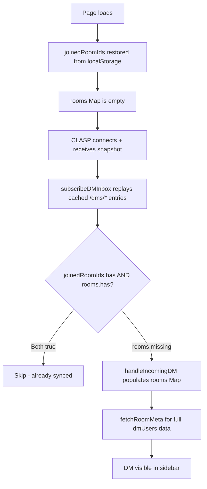

## Namespace Tree

```mermaid
graph TD
    R["/chat/registry/ns"] --> G["gaming"]
    R --> M["music"]
    R --> D["dev"]

    G --> G1["gaming/minecraft"]
    G --> G2["gaming/factorio"]
    G1 --> G1R1["room: survival-server"]
    G1 --> G1R2["room: creative-builds"]
    G2 --> G2R1["room: megabase"]

    M --> MR1["room: listening-party"]
    M --> MR2["room: production-tips"]

    D --> D1["dev/rust"]
    D --> D2["dev/web"]
    D1 --> D1R1["room: async-questions"]
    D2 --> D2R1["room: vue-help"]

    style R fill:#1a1a2e,stroke:#457b9d
    style G fill:#1a1a2e,stroke:#2a9d8f
    style M fill:#1a1a2e,stroke:#9b5de5
    style D fill:#1a1a2e,stroke:#f77f00
```

Namespace metadata is stored at `/chat/registry/ns-meta/{path}`:
```json
{
  "description": "All things Minecraft",
  "isPublic": true,
  "createdBy": "u-1234-abc",
  "createdAt": 1708123456789
}
```

Password protection is stored separately at `/chat/registry/ns-meta/{path}/__auth`:
```json
{
  "passwordHash": "<PBKDF2 hash>",
  "passwordSalt": "<random salt>"
}
```
