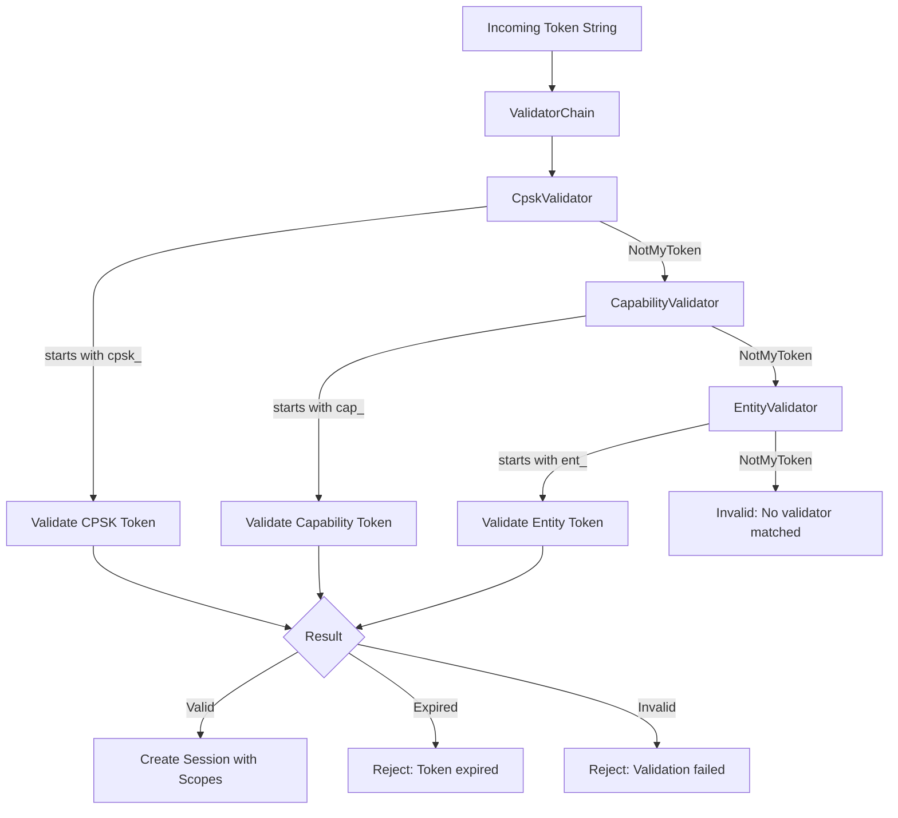
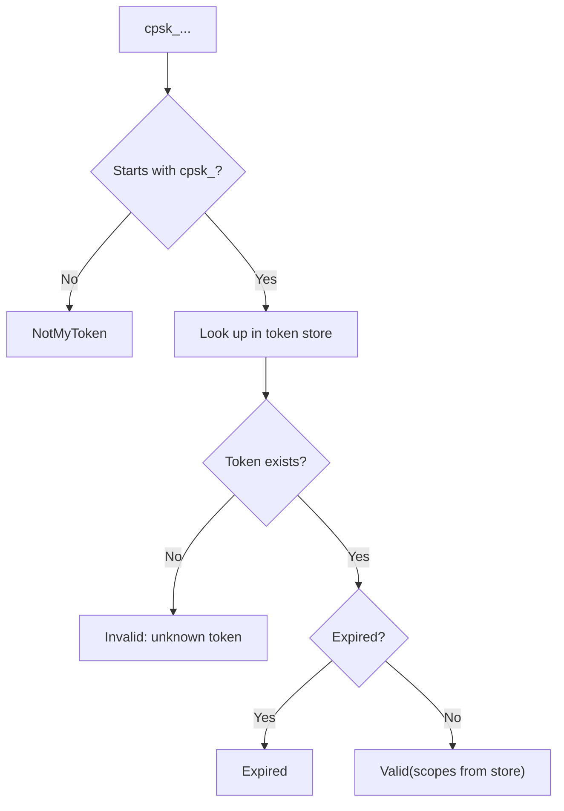
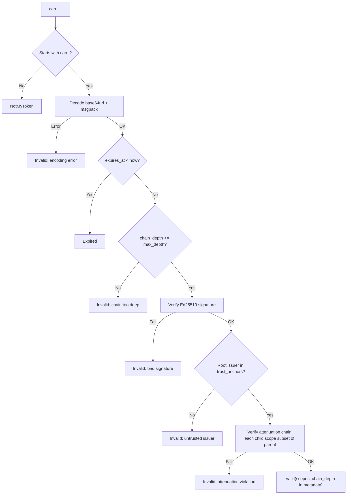
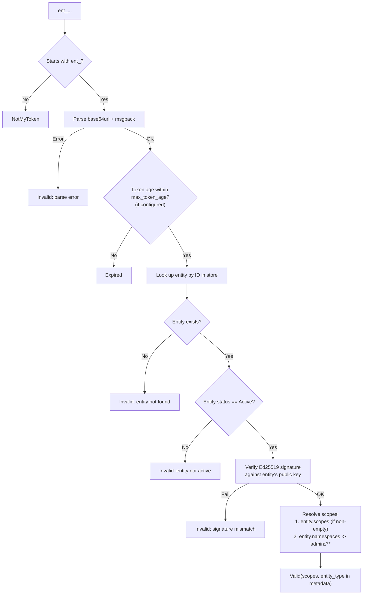
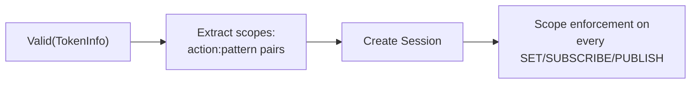

# Token Validation Flow

How CLASP validates authentication tokens using the ValidatorChain dispatch mechanism, supporting multiple token types with a single unified pipeline.

## ValidatorChain Dispatch

CLASP uses a chain-of-responsibility pattern to validate tokens. Each validator checks whether a token belongs to it (by prefix) and either validates it or passes it along:

The ValidatorChain iterates through registered validators. Each returns one of:

| Result | Meaning |
|--------|---------|
| `Valid(TokenInfo)` | Token is valid, includes scopes and metadata |
| `NotMyToken` | Token prefix not recognized, try next validator |
| `Expired` | Token was recognized but has expired |
| `Invalid(reason)` | Token was recognized but failed validation |

## CPSK Token Validation

Pre-shared key tokens (`cpsk_`) are the simplest token type, used for the register/login flow:

CPSK tokens carry scopes assigned at registration time (e.g., `admin:/**`, `write:/lights/**`).

## Capability Token Validation

Capability tokens (`cap_`) are Ed25519-signed tokens with delegation chains:

The root issuer is determined from the proof chain: if proofs exist, the root is `proofs[0].issuer`; for root tokens (no proofs), it is `token.issuer`.

## Entity Token Validation

Entity tokens (`ent_`) are Ed25519-signed identity tokens backed by the entity registry:

## Scope Conversion

When an entity has no explicit scopes but has namespace patterns, they are converted:

| Entity Namespace | Resulting Scope |
|------------------|----------------|
| `/lights` | `admin:/lights/**` |
| `/lights/` | `admin:/lights/**` |
| `/lights/**` | `admin:/lights/**` |

This gives entities full admin access within their declared namespaces.

## Session Creation

After successful validation, the router creates a session with the token's scopes:

Scope enforcement checks:
- **SET**: Requires `write:` or `admin:` scope matching the address
- **SUBSCRIBE**: Requires `read:` or `admin:` scope matching the pattern
- **PUBLISH**: Requires `write:` or `admin:` scope matching the address

## See Also

- [Capability Delegation](capability-delegation.md) -- Delegation chains and scope attenuation
- [Security Model](security-model.md) -- Encryption, tokens, and threat model
- [Distributed Architecture](distributed-architecture.md) -- Overall system architecture
