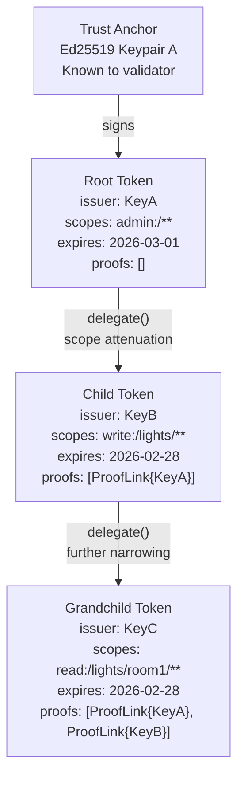
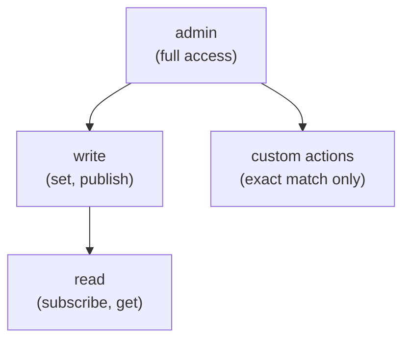
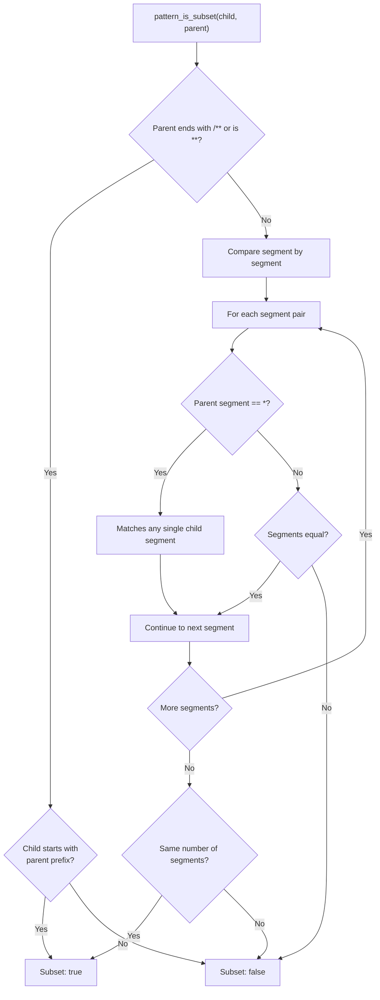
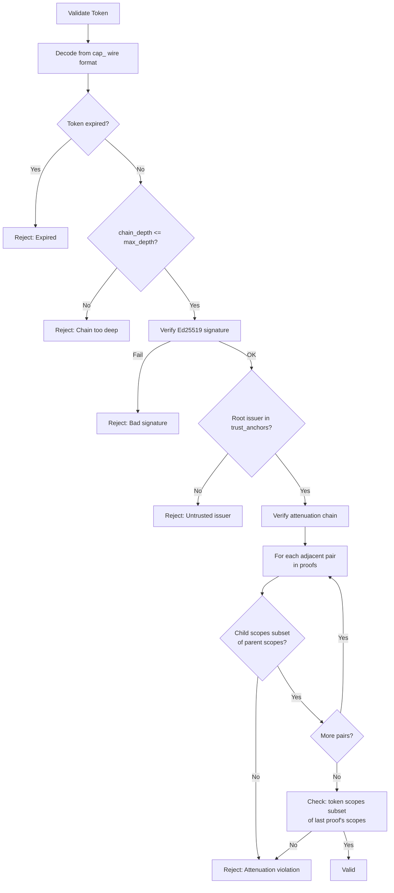

# Capability Delegation

How CLASP capability tokens support delegation chains with scope attenuation, enabling decentralized authorization without a central authority.

## Delegation Chain

Capability tokens form a chain of trust from a root token (signed by a trust anchor) down to leaf tokens with progressively narrower permissions:



Each delegation step:
1. Creates a new token signed by a new keypair
2. Appends the parent's proof to the chain
3. Enforces scope attenuation (child scopes must be a subset of parent)
4. Clamps expiration (child cannot outlive parent)

## Scope Format

Scopes use the format `action:pattern`:

```
admin:/**
write:/lights/**
read:/lights/room1/*
```

The **action** determines what operations are permitted. The **pattern** determines which CLASP addresses the action applies to.

## Action Hierarchy

Actions follow a strict hierarchy where higher-level actions include lower-level ones:



| Parent Action | Allowed Child Actions |
|---------------|----------------------|
| `admin` | Any action (`admin`, `write`, `read`, custom) |
| `write` | `write`, `read` |
| `read` | `read` only |
| custom | Same custom action only (exact match) |

## Pattern Subset Rules

Child patterns must be a subset of parent patterns. The check uses segment-by-segment comparison:

| Child Pattern | Parent Pattern | Allowed? | Reason |
|---------------|---------------|----------|--------|
| `/lights/room1` | `/lights/**` | Yes | Exact path under globstar |
| `/lights/room1/**` | `/lights/**` | Yes | Narrower subtree under globstar |
| `/lights/*` | `/lights/**` | Yes | Single-level under globstar |
| `/lights/**` | `/lights/*` | **No** | Globstar is wider than single wildcard |
| `/audio/**` | `/lights/**` | **No** | Different subtree |
| `/**` | `/lights/**` | **No** | Root globstar is wider |
| `/lights/room1` | `/lights/room1` | Yes | Exact match |

The `pattern_is_subset(child, parent)` function implements these rules:



## Expiration Clamping

Child tokens are automatically clamped to their parent's expiration:

```
parent.expires_at = 2026-03-01T00:00:00Z
requested child expires = 2026-04-01T00:00:00Z
actual child.expires_at = 2026-03-01T00:00:00Z  (clamped to parent)
```

This means:
- You can request a shorter expiration than the parent (allowed)
- You cannot request a longer expiration (silently clamped)
- The entire chain expires when the root token expires

## Chain Depth

Each delegation adds one level of depth:

| Token | `chain_depth()` | `proofs.len()` |
|-------|-----------------|----------------|
| Root token | 0 | 0 |
| Child token | 1 | 1 |
| Grandchild | 2 | 2 |

The `CapabilityValidator` enforces a configurable `max_depth`. Tokens exceeding this depth are rejected with `ChainTooDeep`.

## Proof Chain Structure

Each token carries its full proof chain as a list of `ProofLink` entries:

```rust
struct ProofLink {
    issuer: Vec<u8>,       // Parent's public key
    scopes: Vec<String>,   // Parent's scopes
    signature: Vec<u8>,    // Parent's signature
}
```

When delegating, the parent's proof is appended:

```
Root:       proofs = []
Child:      proofs = [ProofLink{issuerA, scopesA, sigA}]
Grandchild: proofs = [ProofLink{issuerA, scopesA, sigA},
                       ProofLink{issuerB, scopesB, sigB}]
```

## Validation Pipeline

The validator checks the entire chain:



## Replay Prevention

Each token contains a UUID v4 `nonce` field. While the current implementation does not maintain a nonce registry (tokens are validated statelessly), the nonce is included in the signed payload, ensuring each token is cryptographically unique even with identical scopes and expiration.

## Wire Format

Tokens are encoded as `cap_` + URL-safe base64 (no padding) of MessagePack:

```
cap_pLEFcxZ9k2q7mJ8xL5jW4Y9aB...
```

The signed payload covers all fields except the `signature` field itself.

## See Also

- [Token Validation Flow](token-validation-flow.md) -- ValidatorChain dispatch
- [Security Model](security-model.md) -- Encryption and access control overview
- [Distributed Architecture](distributed-architecture.md) -- System overview
