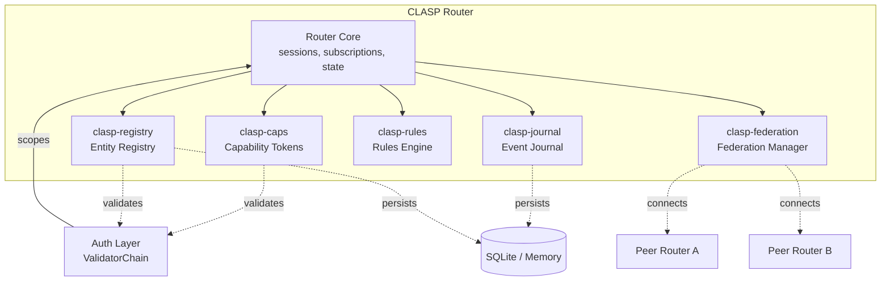
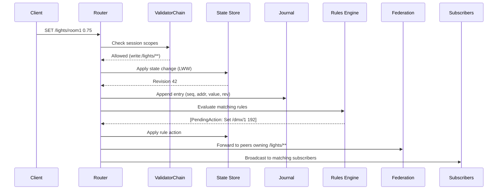
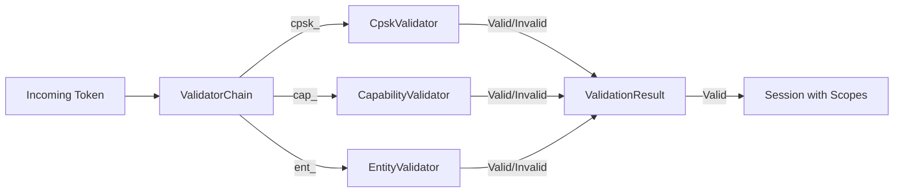
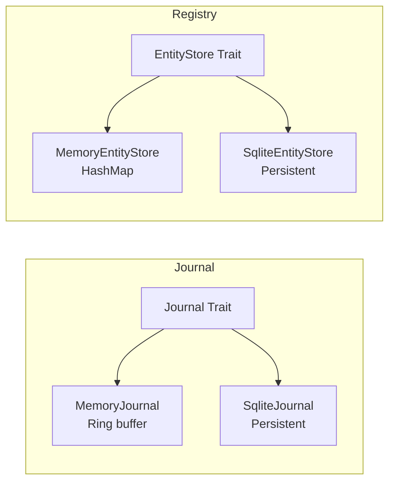
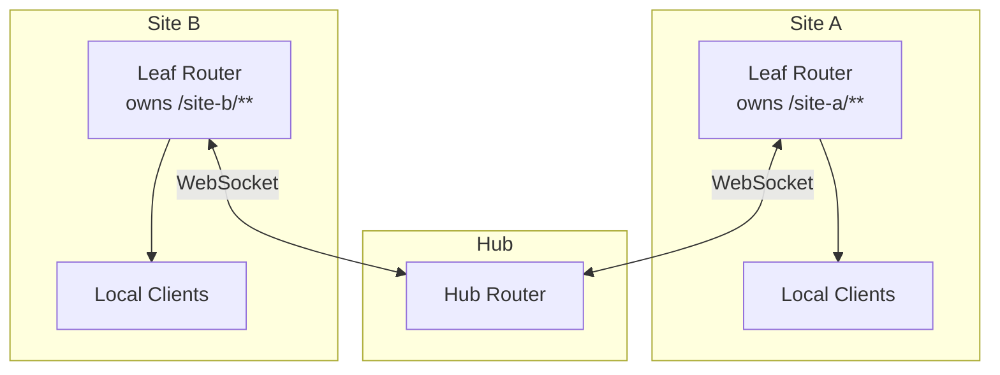

# Distributed Architecture

How CLASP's distributed infrastructure crates extend the core router with authentication, persistence, automation, and multi-site federation.

## Overview

The distributed infrastructure is a set of five opt-in crates that plug into the CLASP router via feature flags. When disabled, they add zero overhead. When enabled, they compose into a layered system where each crate handles a distinct concern:

## Feature Flag Matrix

Each crate maps to a feature flag on `clasp-router`:

| Feature | Crate | What It Adds |
|---------|-------|-------------|
| (none) | `clasp-caps` | Standalone capability token library (no router integration needed) |
| (none) | `clasp-registry` | Standalone entity registry (no router integration needed) |
| `journal` | `clasp-journal` | State persistence, crash recovery, replay |
| `rules` | `clasp-rules` | Reactive automation after state changes |
| `federation` | (built-in) | Hub-side federation peer handling |

The `clasp-caps` and `clasp-registry` crates integrate with the router through `clasp-core`'s `TokenValidator` trait and the `ValidatorChain`, without needing a dedicated router feature flag.

## Message Flow

When a client sends a SET message, it passes through the following stages:

Each stage is optional:
- **Auth**: Only in `Authenticated` security mode
- **Journal**: Only with `journal` feature
- **Rules**: Only with `rules` feature
- **Federation**: Only with `federation` feature and active peers

## Authentication Architecture

CLASP supports three token types, each handled by a dedicated validator:

| Token Prefix | Validator | Crate | Use Case |
|-------------|-----------|-------|----------|
| `cpsk_` | `CpskValidator` | `clasp-core` | Pre-shared keys (register/login flow) |
| `cap_` | `CapabilityValidator` | `clasp-caps` | Delegatable capability tokens |
| `ent_` | `EntityValidator` | `clasp-registry` | Device/service identity tokens |

These are composed into a `ValidatorChain` that dispatches by prefix:

Each validator returns `NotMyToken` for unrecognized prefixes, allowing the chain to try the next validator.

## Persistence Architecture

The journal and registry both use a pluggable storage pattern:

- **Memory backends**: Fast, no dependencies, suitable for development and testing
- **SQLite backends**: WAL mode, persistent across restarts, suitable for production

## Federation Architecture

Federation uses a hub/leaf topology where leaf routers connect to a central hub:

Each leaf declares which namespace patterns it owns. The hub auto-subscribes to those patterns and forwards matching state changes. Loop prevention is handled via the `origin` field on forwarded messages.

See [Federation State Machine](federation-state-machine.md) and [Federation Message Sequence](federation-message-sequence.md) for protocol details.

## See Also

- [Token Validation Flow](token-validation-flow.md) -- ValidatorChain dispatch details
- [Capability Delegation](capability-delegation.md) -- Delegation chains and scope attenuation
- [Federation State Machine](federation-state-machine.md) -- PeerState transitions
- [Federation Message Sequence](federation-message-sequence.md) -- Handshake and sync protocol
- [Security Model](security-model.md) -- Encryption, tokens, and threat model
