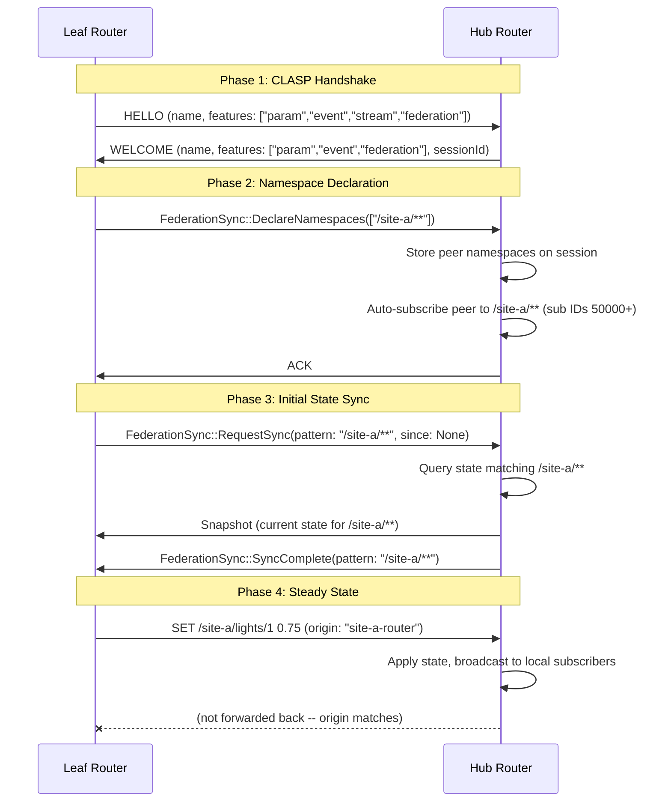
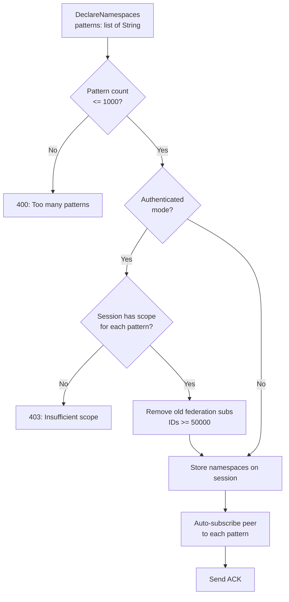
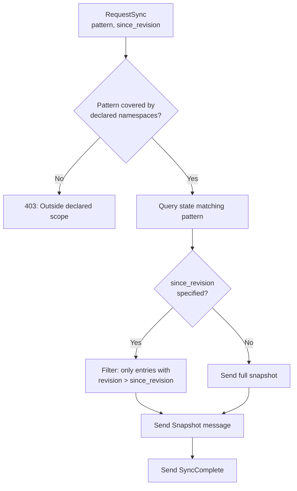
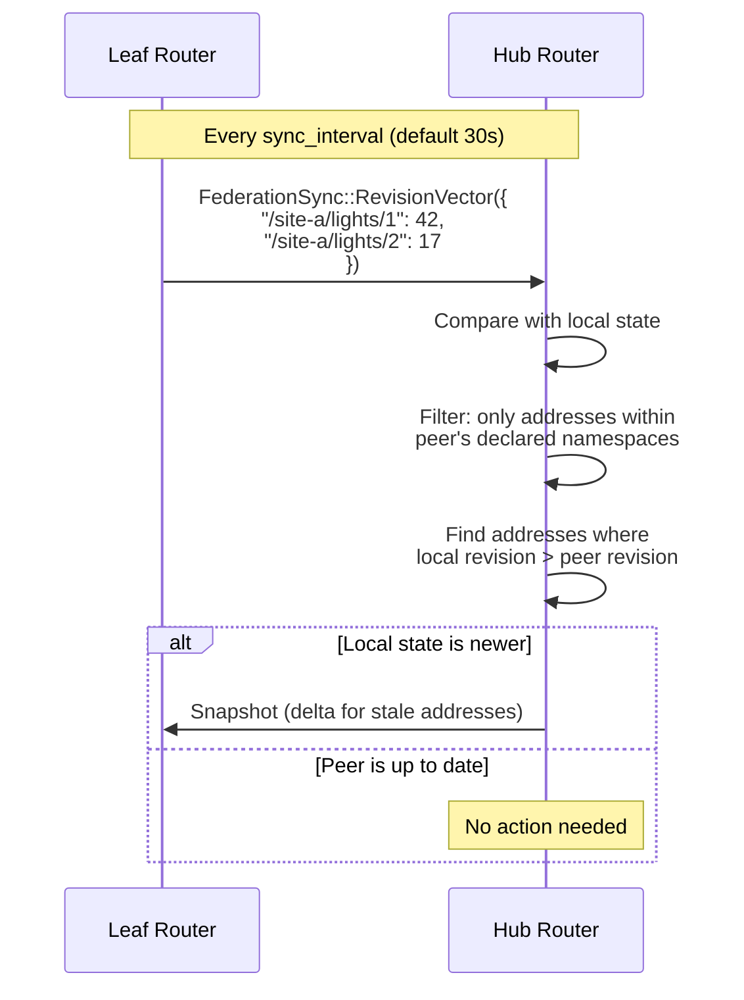
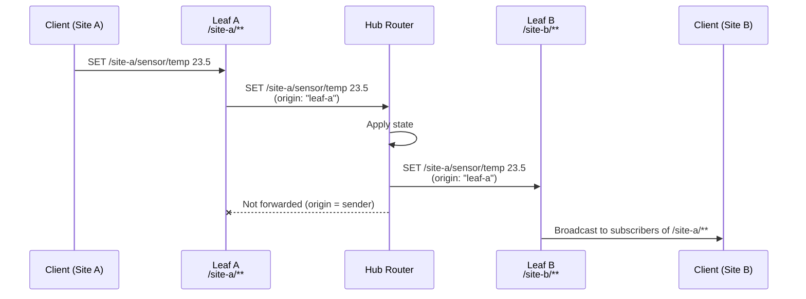

# Federation Message Sequence

Detailed protocol sequences for CLASP router-to-router federation, covering the handshake, initial sync, steady-state forwarding, and revision vector reconciliation.

## Handshake and Initial Sync

## Namespace Declaration

When a federation peer sends `DeclareNamespaces`:

If a peer calls `DeclareNamespaces` again, old federation subscriptions (identified by sub IDs >= 50000) are cleaned up before creating new ones.

## Request Sync

When a federation peer requests state sync:

**Namespace restriction:** `RequestSync` validates that each requested pattern is covered by the peer's declared namespaces using `federation_pattern_covered_by()`. A peer that declared `/site-a/**` cannot request sync for `/site-b/**` or `/**`.

## Revision Vector Exchange

Periodic revision vector exchange detects state drift:

**Resource limit:** Revision vectors are capped at 10,000 entries. Vectors exceeding this limit are rejected with a 400 error.

## Steady-State Forwarding

During active operation, state changes are forwarded based on namespace ownership:

## Loop Prevention

Every forwarded message carries an `origin` field set to the source router's `router_id`. The forwarding logic checks:

1. **FederationLink**: `forward_set()` and `forward_publish()` skip sending if `origin == peer.router_id`
2. **NamespaceManager**: `peers_for_address()` accepts `exclude_origin` to filter out the originating peer
3. **Rules Engine**: Actions with origin starting with `"rule:"` are not re-evaluated by the rules engine

This prevents messages from bouncing back to their source and prevents rule-triggered cascades.

## Namespace Restriction Enforcement

Federation peers can only access data within their declared namespaces:

| Operation | Enforcement |
|-----------|-------------|
| `DeclareNamespaces` | Pattern count <= 1,000; scope check in authenticated mode |
| `RequestSync` | Requested pattern must be covered by a declared namespace |
| `RevisionVector` | Addresses outside declared namespaces are silently skipped |
| `SET/PUBLISH forwarding` | Only messages matching peer's namespace subscriptions are sent |

## See Also

- [Federation State Machine](federation-state-machine.md) -- PeerState transitions
- [Distributed Architecture](distributed-architecture.md) -- Overall system architecture
- [Security Model](security-model.md) -- Authentication and access control
