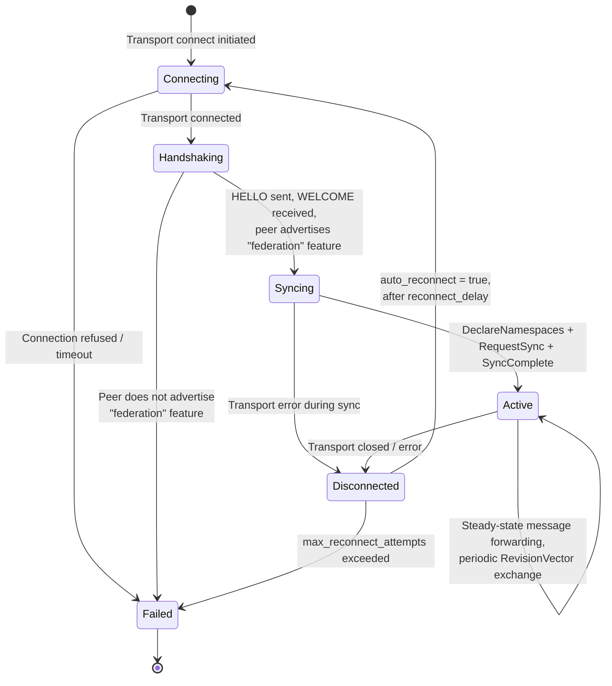

# Federation State Machine

The federation link between two CLASP routers follows a state machine that governs the connection lifecycle, from initial TCP/WebSocket connection through to active message forwarding.

## PeerState Transitions

## State Descriptions

| State | Description | Duration |
|-------|-------------|----------|
| **Connecting** | Transport connection in progress (TCP handshake, TLS negotiation) | Milliseconds to seconds |
| **Handshaking** | Connected, performing CLASP HELLO/WELCOME handshake. Verifies the peer supports the `"federation"` feature. | Sub-second |
| **Syncing** | Declares namespace ownership, subscribes to peer's patterns, requests initial state sync via snapshots. | Seconds (depends on state size) |
| **Active** | Fully operational. Forwards local SET/PUBLISH to peer, receives and applies remote state. Periodically exchanges revision vectors. | Indefinite |
| **Disconnected** | Transport lost. Will auto-reconnect if configured. | `reconnect_delay` (default 5s) |
| **Failed** | Permanently failed. Either the peer rejected the handshake (no federation support) or max reconnect attempts exceeded. | Terminal |

## Transition Conditions

### Connecting to Handshaking

The underlying transport (WebSocket, QUIC) successfully connects. A `FederationLink` is created and begins the CLASP handshake by sending a HELLO message with `"federation"` in the features list.

### Handshaking to Syncing

The peer responds with WELCOME and its features include `"federation"`. If the peer does not advertise federation support, the link transitions to Failed with a `HandshakeFailed` error.

### Syncing to Active

Three operations complete in sequence:

1. **DeclareNamespaces** -- The link sends its `owned_namespaces` to the peer
2. **Subscribe** -- The link subscribes to the peer's declared namespace patterns
3. **RequestSync** -- The link requests snapshots for each subscribed pattern, receiving current state
4. **SyncComplete** -- The peer signals that the initial sync is done

### Active (Steady State)

During active operation:

- **Local changes** matching a peer's namespace are forwarded via SET/PUBLISH
- **Remote changes** from the peer are applied to local state and broadcast to local subscribers
- **Revision vectors** are exchanged every `sync_interval` (default 30s) to detect and resolve drift
- **Ping/Pong** keepalives maintain the connection

### Active to Disconnected

Any transport error or clean close transitions to Disconnected. If `auto_reconnect` is true, the link schedules a reconnect attempt after `reconnect_delay`.

### Disconnected to Connecting

If `auto_reconnect` is enabled and `max_reconnect_attempts` has not been exceeded (0 = unlimited), the link transitions back to Connecting after the configured delay.

### Disconnected to Failed

If `max_reconnect_attempts` is non-zero and all attempts are exhausted, the link transitions to Failed.

## Auto-Reconnect Configuration

| Parameter | Default | Description |
|-----------|---------|-------------|
| `auto_reconnect` | `true` | Enable automatic reconnection |
| `reconnect_delay` | 5 seconds | Delay between reconnect attempts |
| `max_reconnect_attempts` | `0` (unlimited) | Max attempts before giving up |

## See Also

- [Federation Message Sequence](federation-message-sequence.md) -- Detailed handshake and sync protocol
- [Distributed Architecture](distributed-architecture.md) -- Overall system architecture
